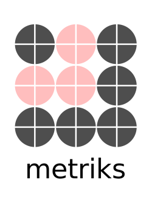

|python| |build| |coverage|

.. |python| image:: https://img.shields.io/badge/python-3.6%20-blue.svg
    :target: https://www.python.org/downloads/release/python-360/
    :alt: Python Version

.. |build| image:: https://travis-ci.com/intuit/metriks.svg?branch=master
    :target: https://travis-ci.com/intuit/metriks

.. |coverage| image:: https://coveralls.io/repos/github/intuit/metriks/badge.svg?branch=master
    :target: https://coveralls.io/github/intuit/metriks?branch=master

-----

metriks is a Python package of commonly used metrics for evaluating information retrieval models.

Available Metrics
---------------------------
+------------------------------------------------------------+-------------------------------------------------------------------------------+
| Python API                                                 | Description                                                                   |
+============================================================+===============================================================================+
| `metriks.recall_at_k(y_true, y_prob, k)`                   | Calculates recall at k for binary classification ranking problems.            |
+------------------------------------------------------------+-------------------------------------------------------------------------------+
| `metriks.precision_at_k(y_true, y_prob, k)`                | Calculates precision at k for binary classification ranking problems.         |
+------------------------------------------------------------+-------------------------------------------------------------------------------+
| `metriks.mean_reciprocal_rank(y_true, y_prob)`             | Gets a positional score on how well you did at rank 1, rank 2, etc.           |
+------------------------------------------------------------+-------------------------------------------------------------------------------+
| `metriks.ndcg(y_true, y_prob, k)`                          | A score for measuring the quality of a set of ranked results.                 |
+------------------------------------------------------------+-------------------------------------------------------------------------------+
| `label_mean_reciprocal_rank(y_true, y_prob)`               | Determines the average rank each label was placed across samples. Only labels |
|                                                            | that are relevant in the true data set are considered in the calculation.     |
+------------------------------------------------------------+-------------------------------------------------------------------------------+
| `metriks.confusion_matrix_at_k(y_true, y_prob, k)`         | Generates binary predictions from probabilities by evaluating the top k       |
|                                                            | items (in ranked order by y_prob) as true.                                    |
+------------------------------------------------------------+-------------------------------------------------------------------------------+

Installation
------------
Install using `pip <https://pypi.org/project/pip/>`_
::

    pip install metriks

Alternatively, specific distributions can be downloaded from the
github `release <https://github.com/intuit/metriks/releases>`_
page. Once downloaded, install the ``.tar.gz`` file directly:
::

    pip install metriks-\*.tar.gz

Development
-----------
1. (*Optional*) If you have `virtualenv` and `virtualenvwrapper` create a new virtual environment:
::

    mkvirtualenv metriks

This isolates your specific project dependencies to avoid conflicts
with other projects.

2. Clone and install the repository:
::

    git clone git@github.com:intuit/metriks.git
    cd metriks
    pip install -e .
    

This will install a version to an isolated environment in editable
mode. As you update the code in the repository, the new code will
immediately be available to run within the environment (without the
need to `pip install` it again)

3. Run the tests using `tox`:
::

    pip install tox
    tox

Tox will run all of the tests in isolated environments 
